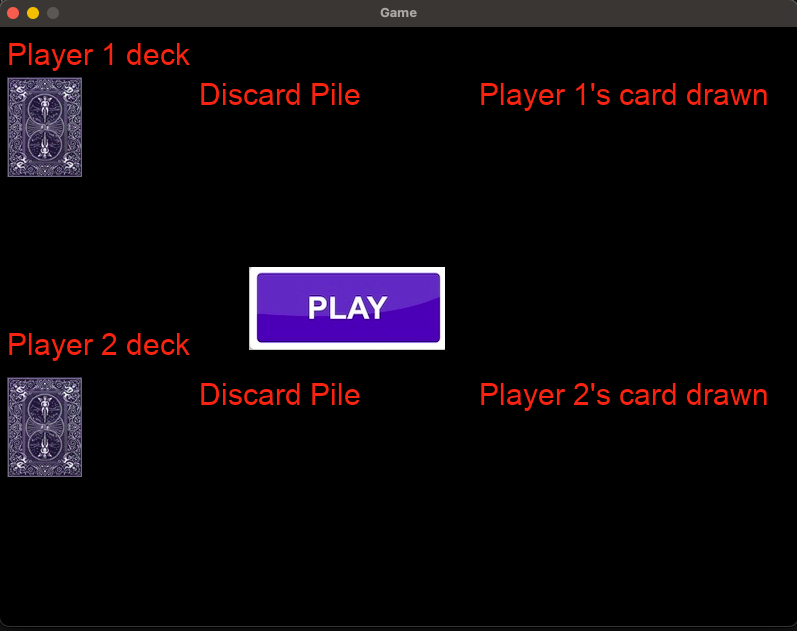
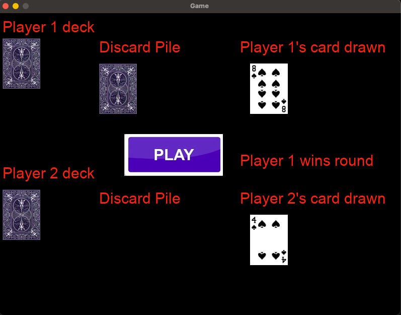
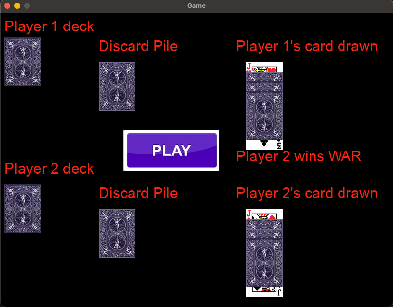
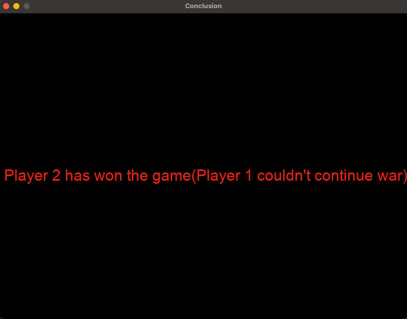

War Game
War Game is a classic card game implemented in Python using the Pygame library. The goal is to simulate the traditional "War" card game where two players draw cards, compare their values, and the higher card wins the round. The game features real-time card dealing, score tracking, and smooth animations using a custom game engine framework.

🧠 About This Project
This project was developed to practice Python programming, object-oriented design, and game development fundamentals with Pygame. All game logic, UI, and flow were coded from scratch, including:

A modular game engine structure with reusable components like Game, Room, GameObject, and event handling.

Card and deck management classes simulating a full 52-card deck.

Real-time gameplay with players drawing and comparing cards, handling ties ("wars"), and discarding.

Multiple UI elements such as buttons, labels, and dynamically rendered cards.

Scene transitions between gameplay and game-over screens.

Use of OOP concepts to maintain clean, manageable code.

Custom animations and visual feedback for card dealing and round outcomes.

The entire game is self-built without external tutorials, relying on experimentation, debugging, and iterative design.

🖼️ Preview

🎮 Game Objective
Each player starts with half the deck.

On each turn, players draw the top card from their deck.

The player with the higher card wins the round and collects both cards.

If cards tie, a "war" is declared: players place additional cards face down and then draw another card to compare.

The game continues until one player collects all the cards and wins.

🧠 Features
✅ Full 52-card deck with suits and values.

✅ Custom card images and dynamic card rendering.

✅ Player hands, discard piles, and deck management.

✅ Smooth UI with buttons for game actions (e.g., "Deal Cards").

✅ Real-time round results and score updates.

✅ Game states managed with room transitions (gameplay, game over).

✅ Object-oriented architecture for maintainability.

✅ Responsive design with clear visual feedback.

🛠️ How to Run
Install Python and Pygame

Ensure Python 3.x is installed on your system. Then install Pygame:

nginx
Copy
Edit
pip install pygame
Run the Game

Navigate to your project folder and run:

nginx
Copy
Edit
python war_game.py
💻 Screenshots

Main Game Screen during a normal round 

Game screen during War

Game Over Screen

⚠️ Known Issues
If you experience any lag or slow card animations, ensure your system meets Pygame requirements.

Mouse click detection works best with standard mouse devices; some touchpads or Mac Retina displays may have minor click sensitivity issues.

🧪 What I Learned
This project helped me improve:

Python OOP design and class inheritance.

Structuring modular and reusable game code.

Event handling and real-time user interaction.

Managing graphics, sprites, and animations in Pygame.

Implementing classic card game rules programmatically.

Debugging complex logic and maintaining state across game rounds.

📜 License
This project is open source for educational use and portfolio showcase. Feel free to fork, modify, or expand upon it!

